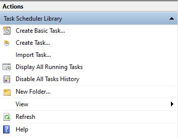
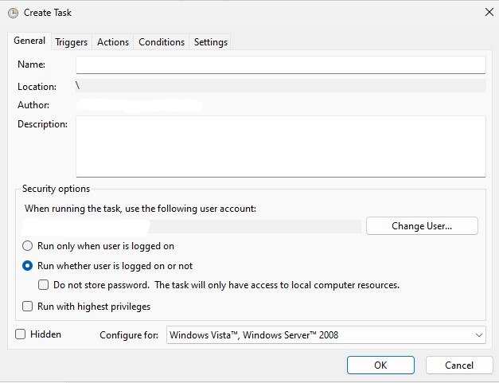
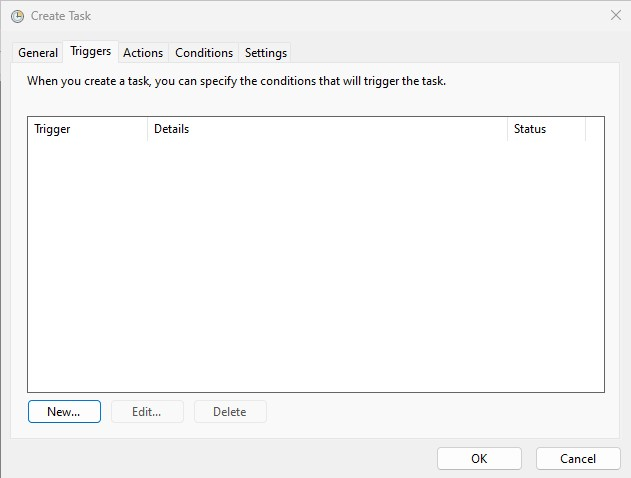
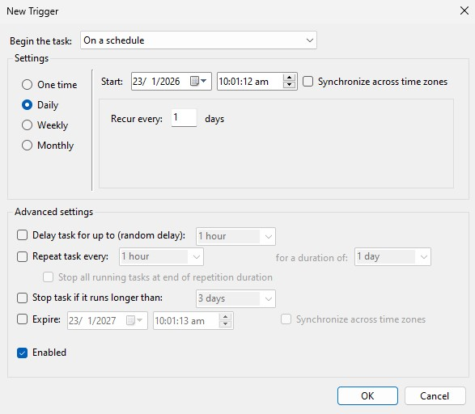
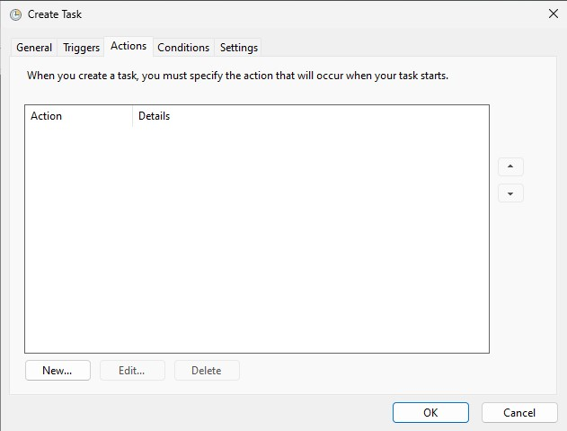
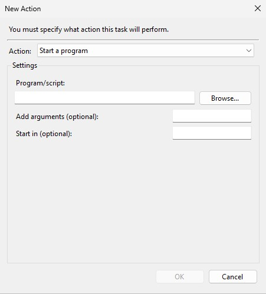
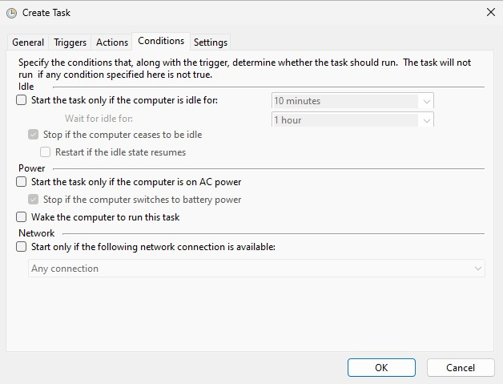
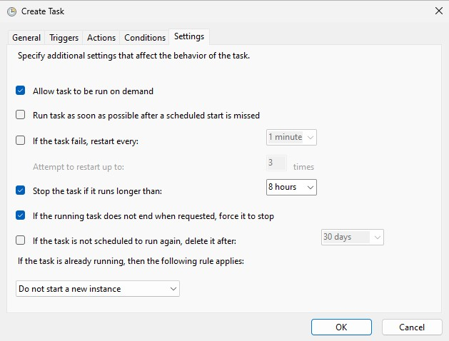

Windows task scheduler is used to run a python script on a scheduled time.

## Create a task
Open windows task scheduler and select `Create Task...` under Actions.

_Select "Create Task..."_

## General tab

_Select "Run whether user is logged on or not"_

## Triggers tab

_Select "New..." to create a new trigger_

_Create a schedule_

## Actions tab

_Select "New..." to create a new action_

_Fill in batch file and folder to start_

## Conditions tab

_Disable all options_

## Settings tab

_Settings configuration_
