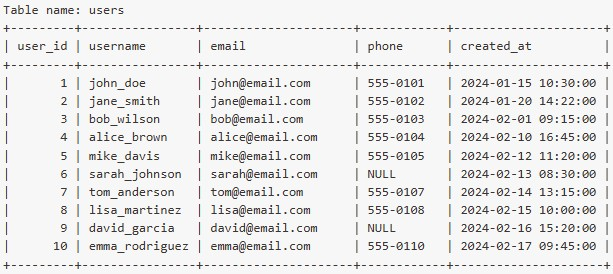
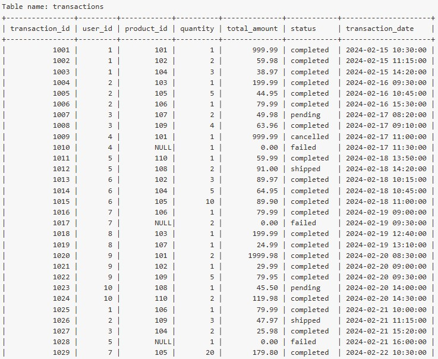
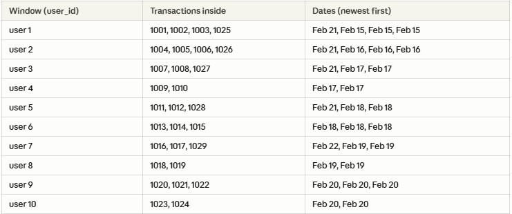
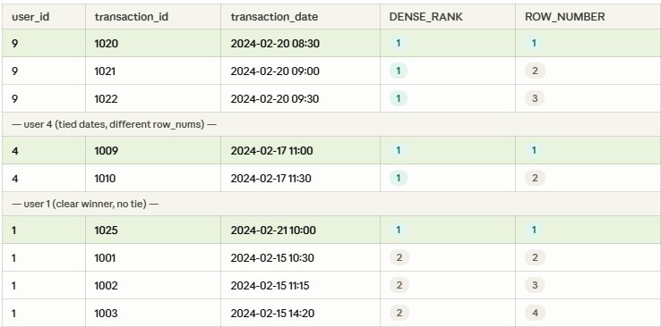
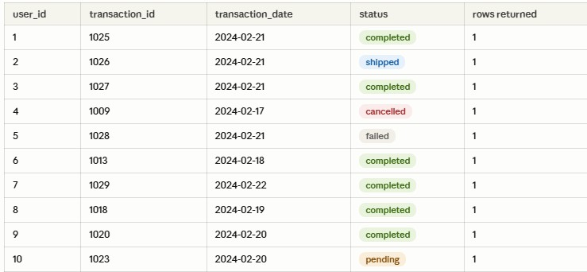

DENSE_RANK() and ROW_NUMBER() are window functions that assign a number to each row within a defined partition, based on a specified order.

ROW_NUMBER() assigns a unique sequential number to every row — no ties are possible, even if rows share the same value. While DENSE_RANK() assigns the same rank to rows with equal values, and continues ranking from the next consecutive number without gaps.

Both functions are commonly used to filter results such as retrieving the top N records or the most recent entry per group.


## Tables
The 2 tables used in this example are `users` and `transactions`.


_Table 1: users_



_Table 2: transactions_


## SQL Question
Return each user's single most recent transaction by transaction_date. Show the username, transaction_id, product_id, total_amount, status, and transaction_date in the final output table.

## SQL Query
```sql
-- Replace ROW_NUMBER() with DENSE_RANK() if required.

WITH cte_1 AS (
    SELECT
        user_id,
        transaction_id,
        product_id,
        total_amount,
        status,
        transaction_date,
        ROW_NUMBER() OVER (PARTITION BY user_id ORDER BY transaction_date DESC) AS rank
    FROM transactions
)
SELECT
    u.username AS 'username',
    cte.transaction_id AS 'transaction_id',
    cte.product_id AS 'product_id', 
    cte.total_amount AS 'total_amount'
    cte.status AS 'status',
    cte.transaction_date AS 'transaction_date'
FROM cte_1 AS cte
LEFT JOIN users AS u 
ON cte.user_id = u.user_id
WHERE cte.rank = 1;
```

## Comparing between DENSE_RANK() and ROW_NUMBER()
The first step to partition by user_id remains the same.


_Figure 1: Partition by user id_

The difference comes in when every row gets a unique number when using ROW_NUMBER(), no ties allowed.


_Figure 2: Assignment of unique number_

Finally, using `cte.rank = 1` in the WHERE clause only keeps only one row per user.


_Figure 3: Latest transaction date for each user._
